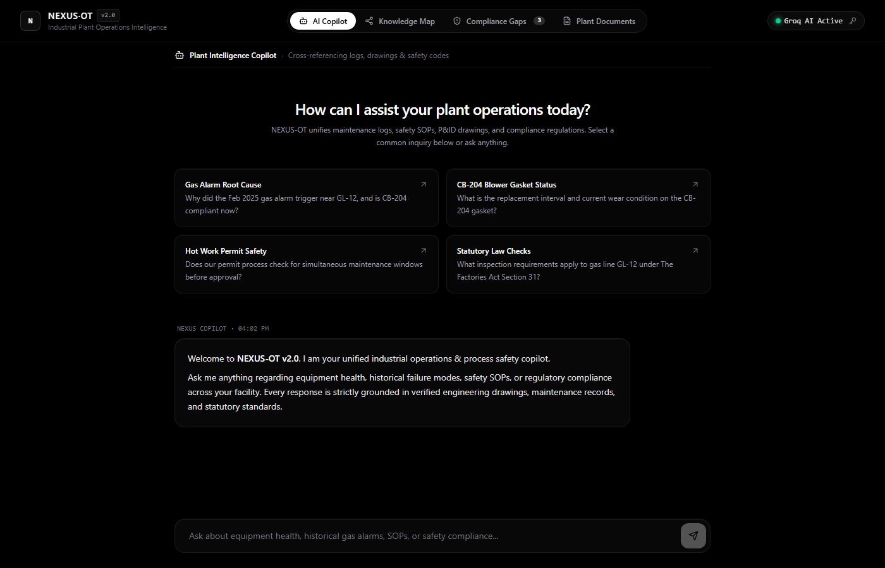
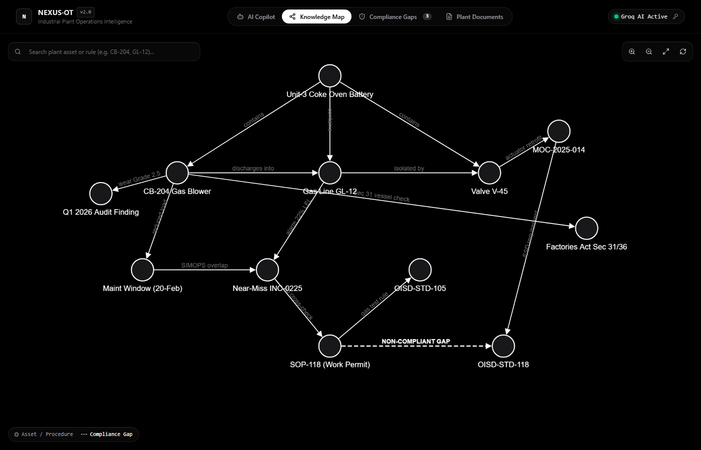
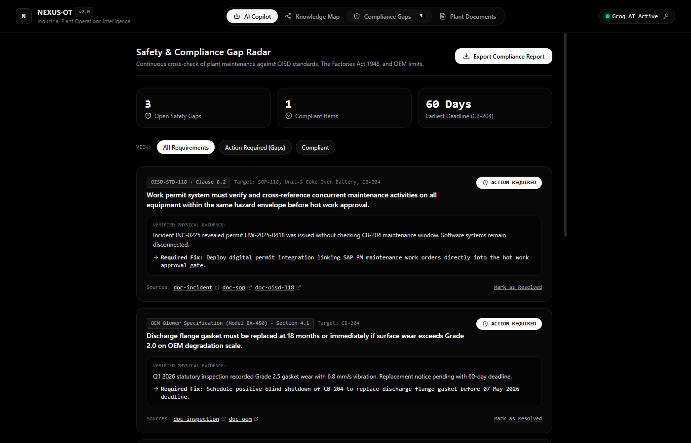
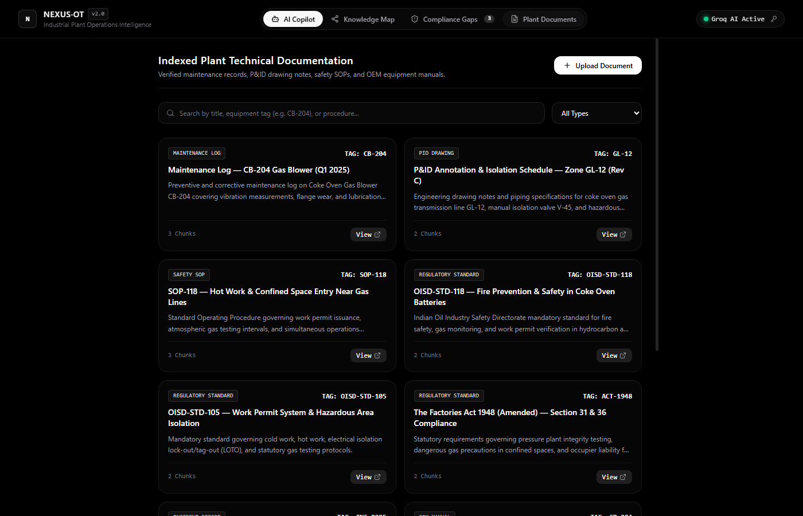

<div align="center">

# NEXUS·OT
### Unified Asset & Operations Brain for Industrial Plants

[](https://nextjs.org/)
[](https://www.typescriptlang.org/)
[](https://groq.com/)
[](https://tailwindcss.com/)
[](LICENSE)

<p align="center">
  <b>Real-Time Operational Technology (OT) Knowledge Intelligence &amp; Continuous Safety Radar</b><br>
  Unifying maintenance histories, P&amp;ID engineering schematics, safety SOPs, statutory safety regulations (OISD, Factories Act 1948, OSHA PSM), and OEM manuals into a single, hallucination-free reasoning layer.
</p>

[Explore Features](#-core-capabilities) • [Live Interface Preview](#-interface-preview) • [Architecture](#-architecture) • [Getting Started](#-getting-started) • [Sample Inquiries](#-sample-operational-inquiries)

---

</div>

## 📌 The Real-World Problem

In heavy process industries (steel, petrochemicals, oil & gas, power generation), **over 80% of critical equipment and safety knowledge is trapped in disconnected silos**:
- **Maintenance Logs:** Buried in CMMS/SAP work orders with obscure free-text notes.
- **P&ID Drawings:** CAD drawings and redlined schematics scattered across local network drives.
- **Safety SOPs:** 100+ page PDF manuals that are impossible to search during time-critical incidents.
- **Statutory Regulations:** Indian Oil Industry Safety Directorate (OISD) standards and The Factories Act 1948 that are only audited once every few years.
- **The "Silver Tsunami":** Decades of undocumented troubleshooting intuition retiring with senior plant engineers.

**When an unexpected gas alarm triggers or a pump vibrates abnormally, engineers are forced to manually cross-reference 3 to 5 separate systems.** A single missed cross-check between a hot-work permit and an un-isolated maintenance window can cause catastrophic loss of life and millions in downtime.

**NEXUS-OT** solves this by constructing a topological Knowledge Graph and querying it with a specialized, zero-hallucination Groq-powered reasoning engine.

---

## 📸 Interface Preview

<div align="center">

### 1. Plant Intelligence Copilot (Grounded Reasoning)
*Cross-references disparate maintenance records, P&amp;ID drawings, and safety standards with verifiable source citations.*
<br><br>


<br><br>

### 2. Interactive Knowledge Map (Cytoscape.js)
*Visualizes physical plant topology, process flows, upstream/downstream isolations, and highlighted regulatory gaps.*
<br><br>


<br><br>

### 3. Continuous Safety &amp; Compliance Gap Radar
*Clause-by-clause cross-checking against OISD-105/116/118, Factories Act Sections 31 &amp; 36, with 1-click audit package export.*
<br><br>


<br><br>

### 4. Technical Document Corpus Library
*Centralized registry for maintenance logs, inspection reports, P&amp;ID notes, and OEM blower manuals with type-aware chunking.*
<br><br>


</div>

---

## ⚡ Core Capabilities

### 1. Zero-Hallucination Industrial Copilot
- **Strict Grounding:** The model is constrained to answer strictly from verified plant records. Every factual claim links to an exact technical excerpt.
- **Off-Topic Guardrails:** Rejects general non-plant inquiries to preserve operational focus.
- **Thinking Trace:** Surfaces retrieval counts, verified standards, and reasoning steps transparently.

### 2. Multi-Stage Hybrid Retrieval Engine
- **Alphanumeric Tag Preservation Tokenizer:** Unlike generic BPE tokenizers that break equipment tags like `CB-204`, `GL-12`, and `10-MOV-0104A` into fragments, NEXUS-OT preserves industrial tags as atomic tokens.
- **BM25 + Semantic Proxy Fusion:** Combines exact keyword matching with dense conceptual proximity using **Reciprocal Rank Fusion (RRF)**:
  $$\text{RRF Score}(d) = \sum_{m \in \{\text{BM25}, \text{Dense}\}} \frac{1}{k + \text{rank}_m(d)}$$
- **Domain Reranker:** Elevates incident RCA reports and regulatory notices when diagnosing root causes or compliance states.

### 3. Topological Knowledge Map
- Powered by **Cytoscape.js** with animated force-directed layout and full zoom, pan, search, and neighborhood highlighting.
- Visualizes equipment assets, hazardous facility zones, procedures, and regulatory codes.
- **Flagged Gap Edges:** Highlights non-compliant relationships (e.g. between SOP-118 and OISD-STD-118) with prominent dashed alert lines.

### 4. Continuous Regulatory Compliance Matrix
- Pre-configured statutory rules covering:
  - **OISD-STD-118 Clause 8.2:** Simultaneous Operations (SIMOPS) cross-checks before hot-work permit issuance.
  - **OISD-STD-105 Clause 4.1.2:** 30-minute atmospheric gas testing frequency limits in combustible zones.
  - **The Factories Act 1948 Section 31 & 36:** Pressure plant ultrasonic examination & dangerous gas containment.
  - **OEM Model BX-450 Limits:** Discharge flange gasket degradation limits (Grade 2.0 replacement threshold).
- **One-Click Audit Package:** Exports a standardized JSON audit evidence bundle ready for statutory inspectors.

---

## 🏗️ Architecture

```
┌────────────────────────────────────────────────────────────────────────┐
│                   MINIMALIST MONOCHROME INTERFACE (PWA)                │
│                                                                        │
│   AI Copilot   │   Knowledge Map   │   Compliance Radar   │   Docs     │
├────────────────────────────────────────────────────────────────────────┤
│                     LAYER 3: REASONING & ORCHESTRATION                 │
│                                                                        │
│   Groq LPU (gpt-oss-120b)  │  Cross-Encoder Reranker  │  RRF Fusion    │
├────────────────────────────────────────────────────────────────────────┤
│                     LAYER 2: INGESTION & RETRIEVAL                     │
│                                                                        │
│   Tag Preservation Tokenizer  │  BM25 Engine  │  Type-Aware Chunker    │
├────────────────────────────────────────────────────────────────────────┤
│                     LAYER 1: DATA REPOSITORY                           │
│                                                                        │
│   Indexed Plant Docs  │  Topological Graph  │  Zustand Reactive Store  │
└────────────────────────────────────────────────────────────────────────┘
```

---

## 🚀 Getting Started

### Prerequisites
- [Node.js](https://nodejs.org/) v18.18+ or v20+
- npm, pnpm, or yarn

### 1. Clone & Install
```bash
git clone https://github.com/Aaravsingh1507/Nexus-OT.git
cd Nexus-OT

npm install
```

### 2. Configure Environment (Groq API)
Create a `.env.local` file in the root directory:
```bash
# Get your free Groq API key at https://console.groq.com/keys
GROQ_API_KEY=your_groq_api_key_here
GROQ_MODEL=openai/gpt-oss-120b
```

*(Note: If no API key is provided, NEXUS-OT automatically switches to its internal deterministic industrial reasoning engine so you can test all features offline.)*

### 3. Run Development Server
```bash
npm run dev
```

### 4. Build for Production
```bash
npm run build
npm start
```

---

## 🧪 Sample Operational Inquiries

You can test NEXUS-OT with these real-world industrial questions directly in the copilot:

1. **Near-Miss Root Cause & Current Asset Health:**
   > *"Why did the gas alarm trigger near GL-12 in February 2025, and is CB-204 currently compliant?"*
   - **Expected Finding:** Identifies simultaneous un-isolated maintenance on CB-204 during pipe insulation hot work; flags that CB-204 is currently non-compliant due to Grade 2.5 flange wear exceeding OEM Grade 2.0 threshold.

2. **Maintenance Interval Cross-Checking:**
   > *"What is the gasket replacement interval for the CB-204 blower and when was it last serviced?"*
   - **Expected Finding:** Cites OEM Model BX-450 specifications (18-month life / Grade 2 wear) and surfaces the pending 60-day statutory replacement notice.

3. **SIMOPS & Safety SOP Analysis:**
   > *"Does our hot work permit process check for active maintenance windows before approval per OISD?"*
   - **Expected Finding:** Flags the critical disconnect in SOP-118 where work permits fail to automatically query SAP PM maintenance schedules, breaching OISD-STD-118 Clause 8.2.

---

## 🛠️ Tech Stack

| Component | Technology | Role |
| :--- | :--- | :--- |
| **Framework** | Next.js 15 (App Router, Turbopack) | Server-side API routes, SSR, PWA layout |
| **Language** | TypeScript 5.0 | Strict end-to-end typing across domain models |
| **Styling** | Tailwind CSS v4 + Glassmorphism | Ultra-minimal black & white frosted glass aesthetic |
| **AI Reasoning** | Groq LPU (`openai/gpt-oss-120b`) | Fast operational inference with citations |
| **Search Engine** | Hybrid BM25 + Dense proxy + RRF | Equipment tag preservation & ranked retrieval |
| **Graph Visualization** | Cytoscape.js | Dynamic topological graph navigation & inspector |
| **State Management** | Zustand | Real-time cross-tab reactive data store |
| **Icons** | Lucide React | Clean, standardized monochrome UI iconography |

---

## 👤 Author
**Aarav Singh**  
B.Tech CSE (AI) — Noida Institute of Engineering and Technology (NIET)  
GitHub: [@Aaravsingh1507](https://github.com/Aaravsingh1507)

---

## 📄 License
This project is licensed under the [MIT License](LICENSE).
